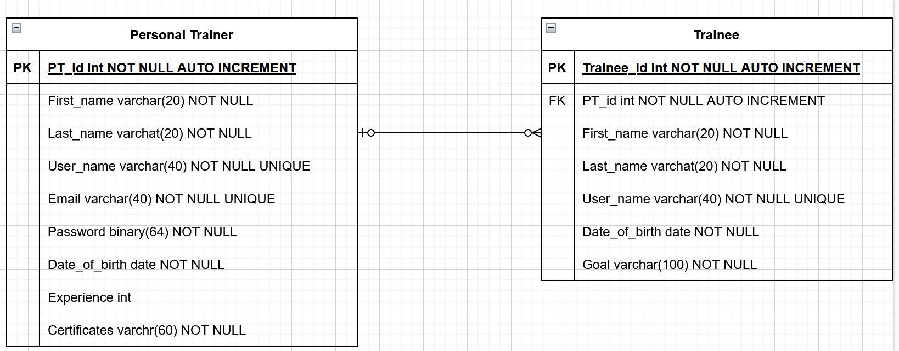
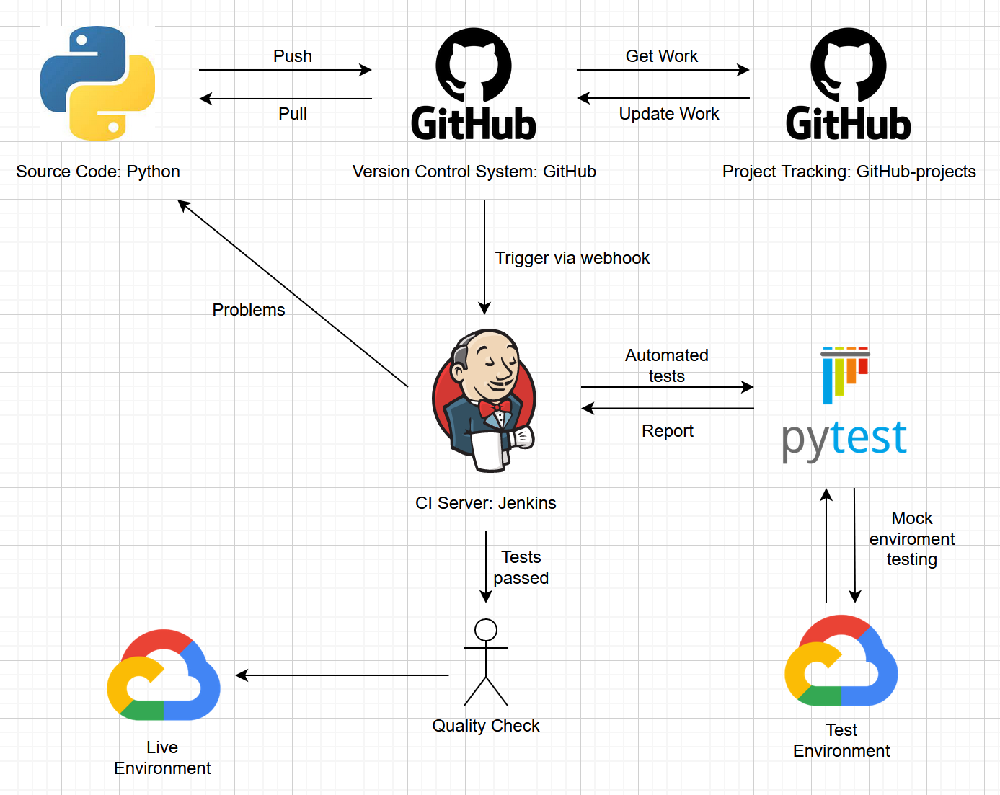
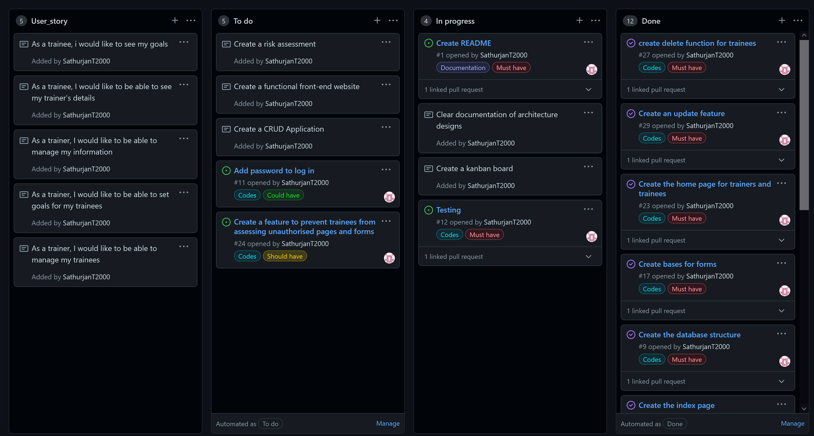
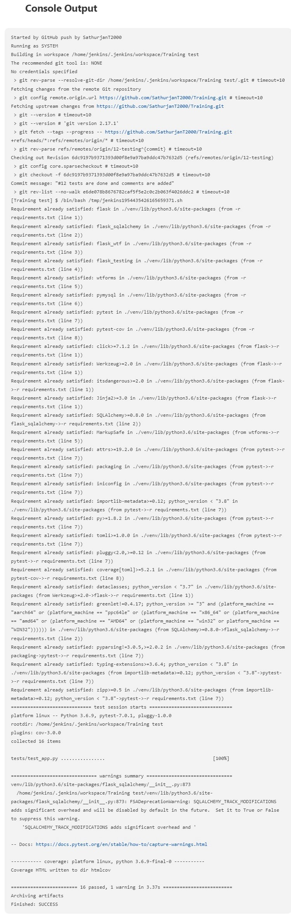
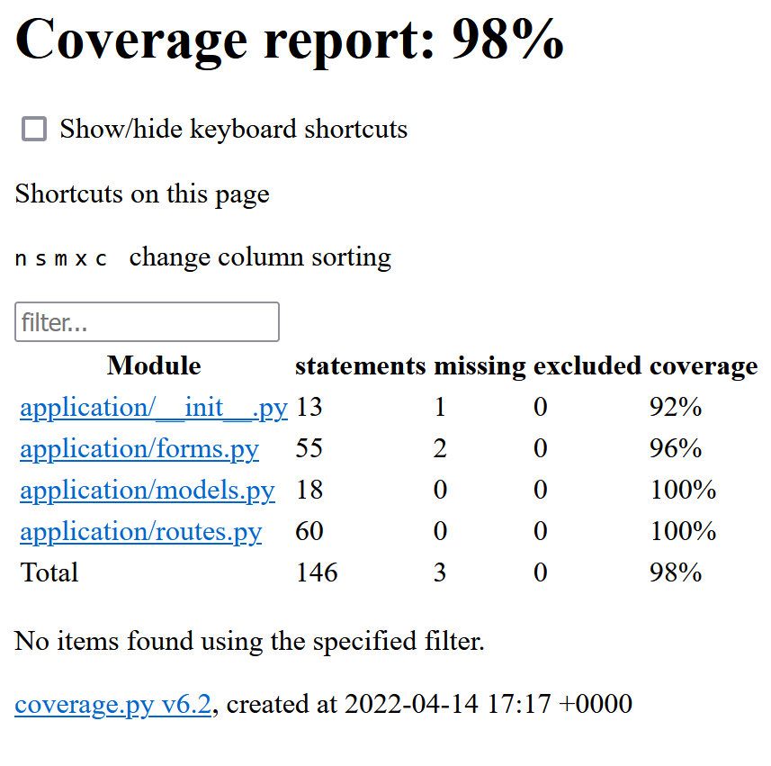
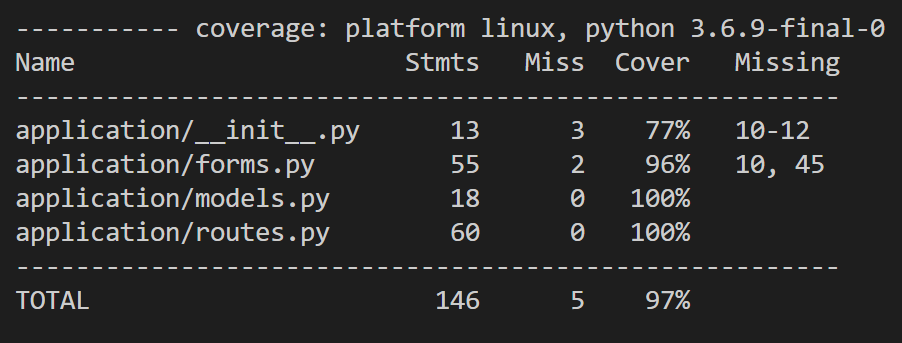

# **TRAINEE MANAGEMENT APP**

## CONTENT
- [Introduction](#intoduction)
- [Brief](#brief)
    - [Requirements](#requirements)
    - [My approach](#my-approach)
- [Architecture](#architecture)
    - [Front-end Structure](#front-end-structure)
    - [Database Structure](#database-structure)
    - [CI Pipeline](#ci-pipeline)
- [Project Tracking](#project-tracking)
- [Risk Assessment](#risk-assessment)
- [Testing](#testing)
- [Known Issues](#risk-assessment)
- [Possible Improvement](#possible-improvement)
- [Resources](#resources)

## INTRODUCTION
This application is for trainers who are having hard time managing their trainees. With this application you will be able to keep track of your trainees and the goals you set for them.

### Before running the application:
Please install everything on the requirements.txt\
Activate your virtual environment\
Set up a secret file with a link to a sql database\
Run the create.py first then app.py

## BRIEF 
To create a CRUD application with utilisation of supporting tools,
methodologies and technologies that encapsulate all core modules
covered during training.\
_C - Create_\
_R - Read_\
_U - Update_\
_D - Delete_

### Requirements 
- A Trello board (or equivalent Kanban board tech) with full expansion on user stories, use cases and tasks needed to complete the project. It could also provide a record of any issues or risks that you faced creating your project.
- A relational database used to store data persistently for the project, this database needs to have at least 2 tables in it, to demonstrate your understanding, you are also required to model a relationship.
- Clear Documentation from a design phase describing the architecture you will use for you project as well as a detailed Risk Assessment.
- A functional CRUD application created in Python, following best practices and design principles, that meets the requirements set on your Kanban Board
- Fully designed test suites for the application you are creating, as well as automated tests for validation of the application. You must provide high test coverage in your backend and provide consistent reports and evidence to support a TDD approach.
- A functioning front-end website and integrated API's, using Flask.
- Code fully integrated into a Version Control System using the Feature-Branch model which will subsequently be built through a CI server and deployed to a cloud-based virtual machine.

### My Approach 
- To satisfy **CREATE** aspect of the app:
    - Trainers will be able to create:
        - Thier own account
        - Trainee acounts
        - Goals for trainees
- To satisfy **READ** aspect of the app:
    - Trainers will be able to read:
        - Trainee's goals
    - Trainees will be able to read:
        - Trainer's details
        - Their own goals
- To satisfy **UPDATE** aspect of the app:
    - Trainers will be able to update:
        - Thier certificates
        - Their details
        - Trainee's goals
- To satisfy **DELETE** aspect of the app:
    - Trainers will be able to delete:
        - Trainee's account

## ARCHITECTURE 
### Front-end Structure 
.png)
.png)
### Database Structure 

**Unfortunatly in this build, password feature was not implemented. However, it will be a fature in the future**
### CI pipeline 

## PROJECT TRACKING 
Project tracking was done via github [projects](https://github.com/SathurjanT2000/Training/projects/1)

## RISK ASSESSMENT 
[Link](./risk_assessment.xlsx)
## TESTING 
Testing was done through pytest and jenkins. 

## KNOWN ISSUES 
Known issues with application:
- Not very secure, anyone can register as a trainer.
- Not very secure, anyone can login with a trainer's username.
- Application will break if a specific url to any pages other than index.html is directly entered.
    - This is due to data being send between webpages.
- No way to recover a Trainer's username if forgotten unless someone has access to the database.
- No way to know a Trainer's username unless someone has access to the database.\

Known issues with testing:

- Application code lines 10 to 12 cannot be tested because in the vm, a secret file is used to import data base link while on jenkins credential is used. Therefore the lines 10 to 12 are part of try-except code directing based on platforms.
- form code line 10 is a default message created when creating validator class, which was not called during this application since custom message was implemented when the validator was called.
- form line 45 is contains "break", it is a necessary, but test seems to be ignoring. No clue why!

## POSSIBLE IMPROVEMENT 
- Could implement a secret-code (given physically) which could be used when registering trainer form or create a secure webpage specifically for registering trainer which could only be accessed by a specific IP range(s).
- Could implement password feature, which will make the log in process more secure.
- Could implement log_in restriction on webpages and redirect them back to index when a specific url is entered.
- Could implement a "forgot username" feature.
- Could show trainer's username on their home page.

## RESOURCES 
[Draw.io](https://app.diagrams.net/) was used to create Database Structure and CI Pipline.\
[Visual Studio Code](https://code.visualstudio.com/) was used to code.\
[Jenkins](https://www.jenkins.io/) was used as CI server.\
[Google Cloud Platform](https://console.cloud.google.com) was used for VM and database.\
[GitHub](https://github.com/) was used for version control and project tracking.\
**QA Community** was used for information.
